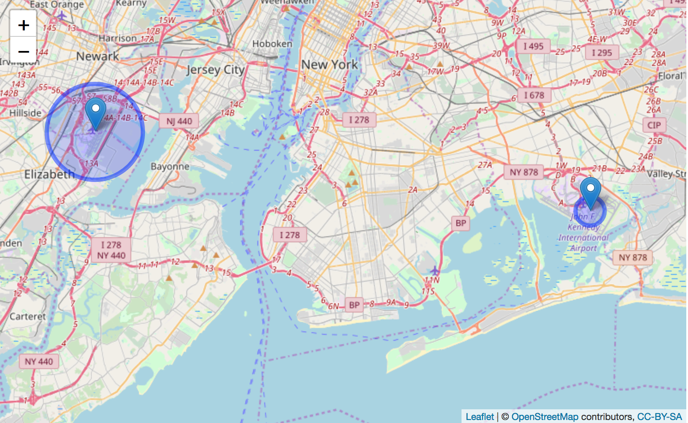
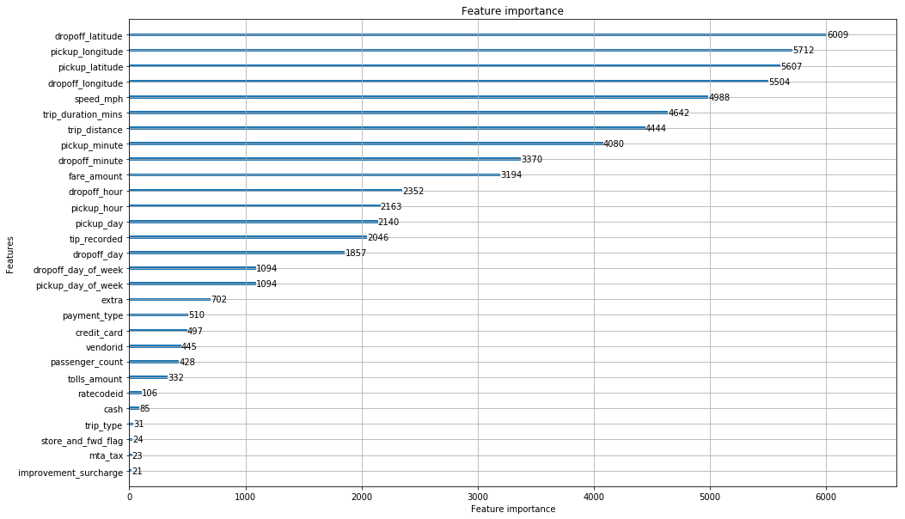
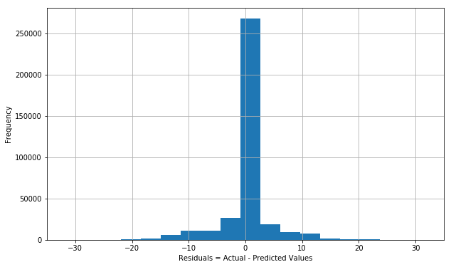

```{r setup, include=FALSE}
 knitr::opts_chunk$set( cache=TRUE )
```
## { .tabset .tabset-fade .tabset-pills }

Author's Workday ID: C175799, Initials: RPR

### Preamble
#### Assumptions & Approach

This is a quick, first pass, discovery summary of the NYC Green Taxi dataset for September 2015.  

I'll do data cleanup on an as needed basis as I answer each of the assigned questions. 

**Assumption for data cleanup**: Throughout this summary, outliers are defined as any value larger than 3 standard deviations from the mean.

**Imputation**: As this is a discovery summary, I'm simply going to drop counter-intuitive values.  A second pass would attempt to ascertain the value of substituting imputed values instead of deleting rows containing them.

#### Libraries Used, R v3.2.3

The usual suspects appear below. To view code, here and elsewhere in this review, click on the "Code" button to the right =======> 
```{r, warning=FALSE, message=FALSE}
library( dplyr )
library( lubridate )
library( ggplot2 )
library( data.table )
library( scales )   # needed for formatting y-axis labels to non-scientific type
library( reshape2 ) # needed for converting wide to tall table
library( leaflet )
library( ggmap )
```

#### Libraries Used, Python v3.6
The majority of the heavy lifting was done using Pandas.  Additionaly, I've used the haversine package, and sampled code from Github for calculating great circle distances, bearing and bearing deltas.  Borrowed code is appropriately documented in the source code.

To install and use XGBoost, <a href="http://xgboost.readthedocs.io/en/latest/build.html">start here</a>.

To install and use LightGB, <a href="https://lightgbm.readthedocs.io/en/latest/Installation-Guide.html">start here</a>.

To install and use Jupyter Notebook, <a href="http://jupyter.readthedocs.io/en/latest/install.html">start here</a>.

To install Haversine package, <a href="https://anaconda.org/conda-forge/haversine">start here</a>.

This document was created using <a href="https://rmarkdown.rstudio.com/authoring_quick_tour.html">RMarkdown</a> and <a href="https://yihui.name/knitr/">Knitr</a> on <a href="https://www.rstudio.com/products/rstudio/#Server">RStudio Server</a>.

To view the data generated, and later used to create this summary (specifically Questions 4 and 5), you can either run all my Jupyter scripts, or download the data <a href="https://drive.google.com/open?id=1Ue1VvDCsaXTPSDl1F3rYteEKcyOwOeuR">here</a>.

### Question 1

#### Load DataFrame

I only downloaded the data once and then cached it locally.

Opening the raw data file takes less than 1 second using fread, which is more than 30x faster then R's default cvs read call. Yay!

```{r, warning=FALSE, message=FALSE}

# only do this ONCE
# # ~13 seconds to fetch...
# system.time( taxis_raw <- fread( "https://s3.amazonaws.com/nyc-tlc/trip+data/green_tripdata_2015-09.csv" ) )
# system.time( fwrite( taxis_raw, "data/green-tripdata-2015-09-raw.csv", verbose=TRUE ) )

# s l o o o o o o w, ~19s to read
# system.time( taxis_raw <- read.csv( "data/green-tripdata-2015-09-raw.csv" ) )

# fast! ~.6 seconds :-)
taxis_raw <- fread( "data/green-tripdata-2015-09-raw.csv" )

```
#### Get Dimensions
```{r}
dim( taxis_raw )
```

### Question 2 

#### Trip Distances: Histogram, Distribution & Hypothesis

What's the distribution of raw trip distance data look like?
```{r}
summary( taxis_raw$Trip_distance )
```
```{r echo=FALSE}
# summary is sufficient!s
# ggplot( taxis_raw, aes( x=Trip_distance ) ) + 
#   geom_histogram( binwidth=2 ) + 
#   xlab( "Trip Distance (miles)" ) + 
#   ylab( "Frequency" ) + 
#   ggtitle( "Histogram of Raw Trip Distances" ) + 
#   scale_y_continuous( labels=comma )
```

#### Limit Trip Distance to < 3 SD from Mean

```{r}
#summary( taxis_raw$Trip_distance )
dist_sd <- sd( taxis_raw$Trip_distance )
# dist_sd #3.076621
dist_mean <- mean( taxis_raw$Trip_distance )
# dist_mean #2.968141

# how many get discarded?
rows_before <- dim( taxis_raw )[ 1 ]
taxis_filtered <- dplyr::filter( taxis_raw, Trip_distance < dist_mean + 3 * dist_sd )
rows_after <- dim( taxis_filtered )[ 1 ]
# rows_before - rows_after #29192
summary( taxis_filtered$Trip_distance )

# http://www.sthda.com/english/wiki/ggplot2-colors-how-to-change-colors-automatically-and-manually
ggplot( taxis_filtered, aes( x=Trip_distance ) ) + 
  scale_y_continuous( labels=comma ) +
  geom_histogram( binwidth=0.25, aes( fill=..count.. ) ) +
  xlab( "Trip Distance (miles)" ) + 
  ylab( "Frequency" ) + 
  ggtitle( "Histogram of Bounded Trip Distances" ) + 
  scale_fill_gradient( low="dark blue", high="blue", name="Frequency", labels=comma )
```

**Observation and Hypothesis of Distribution**:  The distribution of trip distances is skewed right, because negative values for trip distance aren't possible.


### Question 3, Part I

#### Mean and Median Trip Distance by Hour of Day

```{r}
# add pickup hour
taxis_filtered$Pickup_hour <- lubridate::hour( taxis_filtered$lpep_pickup_datetime )
#summary( taxis_filtered$Pickup_hour )

# group by hour
airport_trips_by_hour_grp <- dplyr::group_by( taxis_filtered, Pickup_hour )
airport_trips_by_hour_sum <- dplyr::summarise( 
  airport_trips_by_hour_grp, 
  Mean = mean( Trip_distance ),
  Median = median( Trip_distance )
)
#airport_trips_by_hour_grp

# reshape for plotting
# http://markhneedham.com/blog/2014/09/16/r-ggplot-plotting-multiple-variables-on-a-line-chart/
melted_sums = melt( airport_trips_by_hour_sum, id='Pickup_hour' )
#melted_sums

ggplot( melted_sums, aes( x=Pickup_hour, y=value, colour=variable ) ) + 
  geom_line() + 
  ylab( label="Distance (miles)" ) + 
  xlab( "Hour of Day" )

```

### Question 3, Part II

#### Airport Trips to/from Newark and JFK: Mean Fares, and Other Interesting Characteristics of Trips.
**Trip Counts by RateCodeID**
```{r}
# To find fares starting/stopping at nearby airports, we could: 
# 1) define polygons for newark and jfk, and then run point_in functions (time and cpu intensive) --or--
# 2) use ratecodeid in( 2, 3 ) http://www.nyc.gov/html/tlc/downloads/pdf/data_dictionary_trip_records_green.pdf
# 
# Let's assume codes are used correctly, and use polygons calcs later.
table( taxis_filtered$RateCodeID )
```
What's '99' doing in there? Drop them.
```{r}
taxis_filtered <- dplyr::filter( taxis_filtered, RateCodeID < 7 )
```

**Trip Fares Summary**
```{r}
# TODO: This could be naive(?), other rate code 5 = group rides?
# 2=JFK
# 3=Newark
airport_rides = dplyr::filter( taxis_filtered, RateCodeID %in% c( 2, 3 ) )
# what do the fare values look like?
summary( airport_rides$Fare_amount ) 
```
**Observation**: We need to drop negative fares
```{r}
# fares need to be > $0
airport_rides = dplyr::filter( airport_rides, Fare_amount > 0 )

# histograms for fare and distance, BOTH airports
ggplot( airport_rides, aes( x=Fare_amount ) ) + 
  geom_histogram(  binwidth=2 ) + 
  scale_y_continuous( labels=comma ) +
  xlab( "Fare Amount (USD)" ) + 
  ggtitle( "Fare Amount Frequencies for JFK and Newark" )
```

**Observation**: Amounts appear to be tightly centered on two prices: ~$20 and ~$52.  Are prices to airports fixed?
```{r}
ggplot( airport_rides, aes( x=Trip_distance ) ) + 
  geom_histogram(  binwidth=2 ) +
  scale_y_continuous( labels=comma ) +
  xlab( "Fare Distance (miles)" ) + 
  ggtitle( "Fare Distance Frequencies for JFK and Newark" )
```

**Observation**: It's odd that the distances are highly clustered around zero length trips.  We'll take a look at this further on.


**Analyze Newark Fares Separately**
```{r}
# 2=JFK
# 3=Newark
newark <- dplyr::filter( airport_rides, RateCodeID == 2 )
summary( newark$Fare_amount )
```
**Observation**: Fares are fixed for Newark

```{r}
# after running summary above, there's no need to plot this!
#ggplot( newark, aes( x=Fare_amount ) ) + geom_histogram( binwidth=2 )
# fares are fixed for newark!
```


**Analyze JFK Fares Separately**
```{r}
jfk <- dplyr::filter( airport_rides, RateCodeID == 3 )
ggplot( jfk, aes( x=Fare_amount ) ) + 
  geom_histogram( binwidth=2 ) +
  scale_y_continuous( labels=comma ) +
  xlab( "Fare Amount (USD)" ) + 
  ggtitle( "Fare Amount Frequencies for JFK" )

```

**Observation**: Fares to/from JFK have a fixed minimum, and many passengers appear to pay a set price of ~$20. The few that exceed the set price may have additional fees.  **TODO 2nd Pass**: Obtain domain specific knowledge on fares to JFK.

**Analyze Trip Durations**
```{r}
# look at duration too, lubridate
airport_rides$Trip_duration_mins <- round( as.duration( interval( airport_rides$lpep_pickup_datetime, airport_rides$Lpep_dropoff_datetime ) ) / dminutes( 1 ), 0 )

# skip plot...
#ggplot( airport_rides, aes( x=Trip_duration_mins ) ) + geom_histogram()
# ...just summarize
summary( airport_rides$Trip_duration_mins )
```
**Observation**: 24 hours for a trip to the airport? Now there's an outlier!

**Limit Trip Duration to < 3 SDs**
```{r}
# let's knock off outliers
dur_sd <- sd( airport_rides$Trip_duration_mins )
#dur_sd #87.62333
dur_mean <- mean( airport_rides$Trip_duration_mins )
#dur_mean #8.960674

# how many get discarded?
rows_before <- dim( airport_rides )[ 1 ]
airport_rides <- dplyr::filter( airport_rides, Trip_duration_mins < dur_mean + 3 * dur_sd )
rows_after <- dim( airport_rides )[ 1 ] 
#rows_before - rows_after

ggplot( airport_rides, aes( x=Trip_duration_mins ) ) + 
  geom_histogram( binwidth=2 ) +
  scale_y_continuous( labels=comma ) +
  xlab( "Trip Duration (mins)" ) + 
  ggtitle( "Trip Duration Frequencies for JFK and Newark" )
```

**Observation**: It's unusual that the durations are highly clustered around zero minutes also. We’ll definitely take a look at this further on.

**Mean Fares by Airport**
```{r}
# 2=JFK
# 3=Newark
# table( airport_rides$RateCodeID )
# TODO: Why are rides so short in time and distance, yet so expensive? 
# TODO: Maybe there are many hotels nearby? Or the codes are inaccurate, 
# TODO: Look into polygon defs for airports to see what those fares look like.

# what are the mean fares, per airport?  This omits tips, tolls, tax, surcharge
airport_rides_grp <- dplyr::group_by( airport_rides, RateCodeID )
airport_rides_sum <- dplyr::summarise( airport_rides_grp, Fare=mean( Fare_amount ), Tip=mean( Tip_amount ), Total=mean( Total_amount ), Distance=mean( Trip_distance ), Duration=mean( Trip_duration_mins ) )
# add labels for x axis
airport_rides_sum$Airport <- c( "JFK", "Newark" )
#airport_rides_sum

# Fare
ggplot( airport_rides_sum, aes( Airport, Fare ) ) + 
  geom_bar( stat="identity" ) +
  ylab( "Fare (USD)" ) +
  ggtitle( "Mean Fare by Airport" )
```

**Observation**: That's a mighty large bar plot!

#### Why Are Airport Trip Distances and Durations So Short?


We'll use a Leaflet plot of the mean trip distance per airport to highlight problems with the data.



**Observation**: It appears as though the trip distanecs reported for both airports is the radius of the circle that they inhabit in space.

**TODO 2nd Pass** Look into creating bounding boxes for airport trip pickup and dropoff to see if these points correspond to the same radius or possible real world values.

```{r, warning=FALSE, message=FALSE}
print( "Click the 'Code' button (below) to see code used to create the Leafly screenshot" )

# Knitr chokes on this block, so omit code & generate manually, take a screenshot, and get on with it!

# # download once, as the server repeatedly complains about exceeding quota.
# # nyc_map <- qmap( location="New York City" ) 
# # save( nyc_map, file="data/nyc_map.RData" )
# nyc_map <= load( "data/nyc_map.RData" )
# print( nyc_map )
# 
# meters_in_mile <- 1609.344
# newark_sum <- dplyr::filter( airport_rides_sum, Airport == "Newark" )
# jfk_sum <- dplyr::filter( airport_rides_sum, Airport == "JFK" )
# 
# jfk_popup <- paste( "JFK Mean distance ==", jfk_sum$Distance, "?!?", sep=" " )
# newark_popup <- paste( "Newark Mean distance ==", newark_sum$Distance, "?!?", sep=" " )
# leaflet( nyc_map ) %>%
#   addTiles() %>%
#   addMarkers( lng=-73.7781, lat=40.6413, popup=jfk_popup ) %>%
#   addCircles( lng=-73.7781, lat=40.6413, radius=( meters_in_mile * jfk_sum$Distance  ) ) %>%
#   addMarkers( lng=-74.1745, lat=40.6895, popup=newark_popup ) %>%
#   addCircles( lng=-74.1745, lat=40.6895, radius=( meters_in_mile * newark_sum$Distance  ) )
```

### Question 4 

#### Data Cleanup & Feature Creation

I used Jupyter Notebook with Python 3.6 and Pandas to perform data cleanup and feature generation for model building and predictions.

**Methodology**: As a first pass (1stP) discovery draft, I simply dropped all rows that had counter-intuitive values (negative distance, duration, zero'd lat/lons, etc.), and constrained continuous value ranges to less than 3 SD from the mean.  After cleanup and filtering, 97.38% of the original data set was retained.  Details can be found in the Jupyter notebook files referenced below.

**Feature Generation**: Besides creating a derived 'tip_percent' field, I also added binned fields for day of week, hour, and minutes for pickups and dropoffs, ground speed, etc.  Further details provided in source code.

**Source Code**:

See <a href="question-4-part-I-cleanup.html">Part I: Data Cleanup</a>, rendered as static HTML  The exececutable version, *.ipynb, can be found in the same directory as this document.

#### Tip Prediction: Initial Intuitions

**Initial Intutions**: I suspected, up front, that tips would vary across the hours of the day and the days of the week, and plotted this as a exploratory heatmap before fitting any models for predicting tips as percentage:

```{r}
taxis_cleaned <- fread( "data/green-tripdata-2015-09-cleaned.csv" )
# 1st: group by day/hour, regardless of payment_type, even though this also affects tips
#trips_with_tips           <- dplyr::filter( taxis_cleaned, payment_type == 1 )
trips_by_day_and_hour_grp <- dplyr::group_by( taxis_cleaned, pickup_day_of_week, pickup_hour )
trips_by_day_and_hour_sum <- dplyr::summarise( trips_by_day_and_hour_grp, Tip=mean( tip_percent ), Mph=mean( speed_mph ) )

# heatmap of tips by hour
ggplot( trips_by_day_and_hour_sum, aes( x=as.factor( pickup_day_of_week ), y=as.factor( pickup_hour ), fill=Tip ) ) + 
  geom_tile() +
  # days of week start w/ 0=mon in Python's datetime.weekday(): https://docs.python.org/3/library/datetime.html
  scale_x_discrete( name='Day of Week', labels=c( '0'='Mon','1'='Tue','2'='Wed','3'='Thu','4'='Fri','5'='Sat','6'='Sun' ) ) +
  ylab( "Hour of Day" ) +
  ggtitle( "Tips by Day and Hour" ) +
  scale_fill_gradientn( colors=c( 'black','dark green','green', 'yellow','white' ) ) 
```

Additionally, I also hypothesized that the origin and destination of the trips would affect tips given. This was confirmed by LightGB's important factors plot below. Here's a simplistic heatmap of tips plotted by lat/lons:  

```{r, warning=FALSE, message=FALSE}
# tips by dropoff lat/lon
# bin lat/lons, using 1 degree of precision ~7x7mile bins, 2 ~.7miles, 3 ~.07 miles (364ft)
taxis_cleaned$dropoff_longitude_bin <- round( taxis_cleaned$dropoff_longitude, 2 )
taxis_cleaned$dropoff_latitude_bin <- round( taxis_cleaned$dropoff_latitude, 2 )
taxis_cleaned$pickup_longitude_bin <- round( taxis_cleaned$pickup_longitude, 2 )
taxis_cleaned$pickup_latitude_bin <- round( taxis_cleaned$pickup_latitude, 2 )

trips_by_dropoff_grp <- dplyr::group_by( taxis_cleaned, dropoff_longitude_bin, dropoff_latitude_bin )
trips_by_dropoff_sum <- dplyr::summarise( trips_by_dropoff_grp, Count=n(), Tip=mean( tip_percent ) )

# not quite there yet!
# ggmap( nyc_map_ggmap ) + 
#   geom_point( data=trips_by_dropoff_sum, aes( x=dropoff_longitude_bin, y=dropoff_latitude_bin, fill=Tip ),  alpha=.25, size=0.5 ) +
#   ylab( "Latitude" ) +
#   xlab( "Longitude" ) +
#   ggtitle( "Tips by Dropoff Lat/Lon" ) +
#   scale_fill_gradientn( colors=c( 'yellow', 'orange', 'red', 'dark red', 'black' ) ) #+
#   # xlim( -75, -72.5 ) +
#   # ylim( 40.5, 41 )

ggplot( trips_by_dropoff_sum, aes( x=dropoff_longitude_bin, y=dropoff_latitude_bin, fill=Tip ) ) +
  geom_tile() +
  ylab( "Latitude" ) +
  xlab( "Longitude" ) +
  ggtitle( "Tips by Dropoff Lat/Lon" ) +
  scale_fill_gradientn( colors=c( 'yellow', 'orange', 'red', 'dark red', 'black' ) ) +
  xlim( -75, -72.5 ) +
  ylim( 40.5, 41 )
```

**TODO**: When time permits, synchronize lat/lon bins with the coordinates of a map of NYC, overlay them, invert color palette, scale both alpha and geom_point size by the square root of the tip mean: bigger tip percentages are rendered larger, and more opaque - this will help keep the lower tip means from overwhelming our perception of the larger, and scarcer, mean tip values  Also: experiment with setting a min tip value larger than zero.

#### Tip Prediction: Data Cleanup and Model Building

**Methodology**: I chose to use both XGBoost and LightGB for fitting initial models and making predictions largely because they are easy to use and understand, take significant advantage of my server's GPU, and are used to win an astonishing amount of Kaggle competitions. See this article for further discussion of the <a href="https://medium.com/syncedreview/tree-boosting-with-xgboost-why-does-xgboost-win-every-machine-learning-competition-ca8034c0b283"> advantages of using XGBoost</a>

First I created an XGB model to predict the posssibility that a given taxi trip would result in a tip being given (better said: "...a tip being recorded"), my "out of the box" model achieved ~94% accuracy. After that I created models for predicting 'tips_percent' using both XGBoost and LightGB, which had an RMSE of ~4.86.  Both algorithms chewed through ~1.4M records and created models in less than 20 seconds.

**Observation 1**: It's all about location, location, location.  In addition to the day, hour and minute being important, the lat/long of where a trip begins or ends is of the utmost importance.



**Observations 2**: The residuals for LightGB's predictions are centered closely on zero and are symmetric.



**TODO**: When time permits, automate the creation and optimization of multiple heterogenous mdels via grid search and <a href="https://mlwave.com/kaggle-ensembling-guide/">build ensembles</a> with them.

**Source Code**:

See <a href="question-4-part-II-prediction.html">Part II: Predicting Tips</a>, rendered as static HTML.  The exececutable version, *.ipynb, can be found in the same directory as this document.

### Question 5

#### Ride Sharing

**Problem**: Build a function that given point a point P, find the k trip origination points nearest P

**Bonus**: Consider how day of week and time affect availabilty and speed of pickup

**Performance and Efficiency**: How well does the approach work?

**At first glance, three possible solutions come to mind**: 

1) Create a bin'd lat/lon matrix, calculate each taxi's straight line trajectory through the matrix space, and then query the matrix for trajectories that intersect a given passenger's location in time and space.  This would be decidedly non-trivial.

2) Calculate a given taxi's most probably route through time and space, and then perform similar queries for intersection, as above. Ridiculously non-trivial, and not at all supported by the dataset.

3) Create bin'd lat/lon fields per pickup, and then calculate mean availability, mean MPH per hour of day and day of week, and then query for all pickups typically occuring in the same day and hour. Compare bearing deltas and choose closest taxis in time and space that should be able to arrive w/in 10 minutes.  This is the simplest approach.

I chose to implement solution #3, the simpler search algorithm, and test it by running a simulation.  The results were surprising and performant.

**Approach**: Given a point P, I rounded its origin lat/lon down by 2 decimal point places.  Using a runtime configurable lat/lon window size which defaulted to ~3/4 mile square, I searched for all taxis w/in this window, including the day of week, and hour of day. After calculating the mean availability of these taxis across the month, I calculated mean appearance values in minutes (i.e., _one taxi appears every x minutes in this lat/lon/day/hour window_), and added this to the haversine calculation for the distance between the taxis and the point P.  I filtered this result set by both the taxi's pre-calcualted bearings, the point P's bearing, and a maximum configurable arrival time of 10 minutes, which is calculated using a lookup table for mean MPH for any given day and hour of the week.

**How day of week and time affect availabilty and speed of pickup**:

```{r}
# heatmap of mph by day and hour
ggplot( trips_by_day_and_hour_sum, aes( x=as.factor( pickup_day_of_week ), y=as.factor( pickup_hour ), fill=Mph ) ) + 
  geom_tile() +
  # days of week start w/ 0=mon in Python's datetime.weekday(): https://docs.python.org/3/library/datetime.html
  scale_x_discrete( name='Day of Week', labels=c( '0'='Mon','1'='Tue','2'='Wed','3'='Thu','4'='Fri','5'='Sat','6'='Sun' ) ) +
  ylab( "Hour of Day" ) +
  ggtitle( "Mph by Day and Hour" ) +
  scale_fill_gradientn( colors=c( 'black','dark blue','blue', 'light blue', 'white' ) ) 
```  

After testing this approach on an ad-hoc basis, I then created a multi-core parallel processing algorithm to simulate random new ride share requests for ~1K lat/lon bins, which were compiled from all ride lat/lon origins in the dataset. These bin are each approximately .75 miles square.  Each of these ~1K bins was used as the max/min bounds for generating random request origin lat/lons.  The data set was queried, using random bearings (i.e, between 0 and 360) for each request, for all of these bins over a 7 day x 24 hour matrix, yielding ~167K requests.

```{r}
misses <- fread( "data/taxis-nearby-misses-2.csv" )
hits   <- fread( "data/taxis-nearby-hits-2.csv" )
miss_count <- dim( misses )[ 1 ]
 hit_count <- dim( hits )[ 1 ]
hit_percent = round( hit_count / ( hit_count + miss_count ) * 100, 2 )
mins_to_completion <- 25
queries_per_second <- ( 989 * 7 * 24 ) / mins_to_completion / 60
cores <- 10
```

Of these ~167K requests, ~`r hit_percent`% were hits. That is, taxis having arrival times of less than 10 minute and similar bearings were found in `r hit_percent`% of all of possible ~167 permutations of lat, lon, day and hour of the week.  Those that were classified as misses can be considered requests for new, non-share rides.

**Observation**:  The misses, plotted in black below, appear to correspond to "low traffic" areas that, in general, lie further away from the Green Taxi traffic center of gravity.

**Performance**: These ~167K queries were distributed across 10 of the 12 cores on my developer's class Deep Learning server (12 Hyperthreaded Core Intel i7 @ 4.7 GHz w/ 64GB RAM and 500GB SSD). Calculations completed in ~25 minutes, yielding an aggregate of ~`r round( queries_per_second, 1 )` queries per second. 

```{r, warning=FALSE, message=FALSE}
# separated these blocks to cache map
nyc_map_ggmap <- get_map( location="New York City" ) 
```

```{r, warning=FALSE, message=FALSE}
#summary( hits$taxis_nearby )
q_min <- 1
#q_min
q_1st <- quantile( hits$taxis_nearby, 0.25, names=FALSE )[ 1 ]
#q_1st
q_2nd <- quantile( hits$taxis_nearby, 0.50, names=FALSE )[ 1 ]
#q_2nd
q_3rd <- quantile( hits$taxis_nearby, 0.75, names=FALSE )[ 1 ]
#q_3rd
q_max <- max( hits$taxis_nearby )
#q_max

min_hits <- dplyr::filter( hits, taxis_nearby == 1 )
#dim( min_hits )
q_1st_hits <- dplyr::filter( hits, taxis_nearby > 1 & taxis_nearby <= q_1st )
#dim( q_1st_hits )
q_2nd_hits <- dplyr::filter( hits, taxis_nearby > q_1st & taxis_nearby <= q_2nd )
#dim( q_2nd_hits )
q_3rd_hits <- dplyr::filter( hits, taxis_nearby > q_2nd & taxis_nearby <= q_3rd )
#dim( q_3rd_hits )
q_4th_hits <- dplyr::filter( hits, taxis_nearby > q_3rd & taxis_nearby <= q_max )
#dim( q_4th_hits )

# KLUDGE: Using embedded numerics w/in my_colors forces the proper color dot to be associated with the proper legend position
# KLUDGE: Embedding used because this doesn't work: https://stackoverflow.com/questions/14934522/ggplot-wrong-color-assignment
my_colors <- c( "my_0_black"="black", "my_1_dark_red"="dark red", "my_2_red"="red", "my_3_orange"="orange", "my_4_yellow"="yellow", "my_5_green"="green" )
#my_breaks <- c( 0, q_min, q_1st, q_2nd, q_3rd, q_max )

q1_label <- paste( "1st Q:", 2, "-", q_2nd, "Taxis" )
q2_label <- paste( "2nd Q:", q_2nd + 1, "-", q_3rd, "Taxis" )
q3_label <- paste( "3rd Q:", q_3rd + 1, "-", q_max - 1, "Taxis" )
q4_label <- paste( format( c( q_max ), big.mark=",", trim=TRUE ), "Taxis" )
  
ggmap( nyc_map_ggmap ) + 
  geom_point( data=misses, aes( x=lon, y=lat, color="my_0_black" ), alpha=.075, size=0.01 ) +
  geom_point( data=min_hits, aes( x=my_lon, y=my_lat, color="my_1_dark_red" ), alpha=.5, size=0.02 ) +
  geom_point( data=q_1st_hits, aes( x=my_lon, y=my_lat, color="my_2_red" ), alpha=.25, size=0.02 ) +
  geom_point( data=q_2nd_hits, aes( x=my_lon, y=my_lat, color="my_3_orange" ), alpha=.125, size=0.02 ) + 
  geom_point( data=q_3rd_hits, aes( x=my_lon, y=my_lat, color="my_4_yellow" ), alpha=.075, size=0.02 ) +
  geom_point( data=q_4th_hits, aes( x=my_lon, y=my_lat, color="my_5_green" ), alpha=.050, size=0.02 ) +
  ggtitle( "Ride Sharing: Taxis w/in 10 mins and 90° of Bearing Δ" ) +
  # set dots in legend size
  guides( colour=guide_legend( override.aes=list( size=3 ) ) ) +
  # set colors and labels for legend
  scale_color_manual( values=my_colors, labels=c( "None", "1 Taxi", q1_label, q2_label, q3_label, q4_label ), name="Available Taxis" )
```

See <a href="question-5-part-I-search.html">Part I: Parallelized 'N Closest Taxis' Search</a> and <a href="question-5-part-II-search-summary.html">Part II: Search Post Processing</a>, rendered as static HTML.  The exececutable versions of the same name (*.ipynb), can be found in the same directory as this document.


